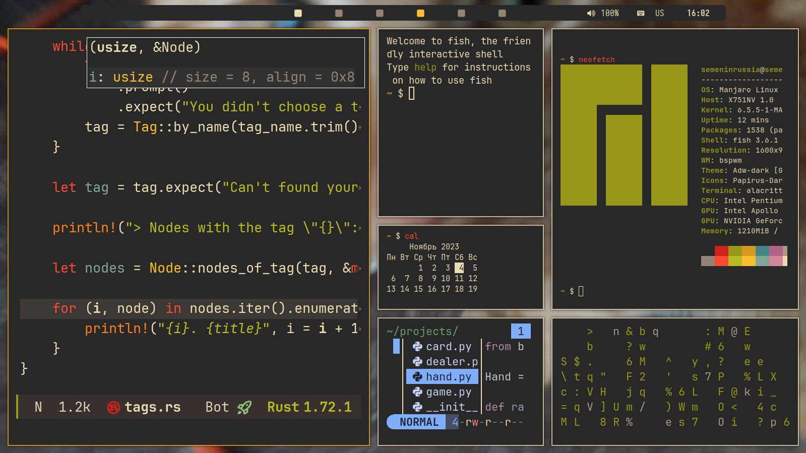
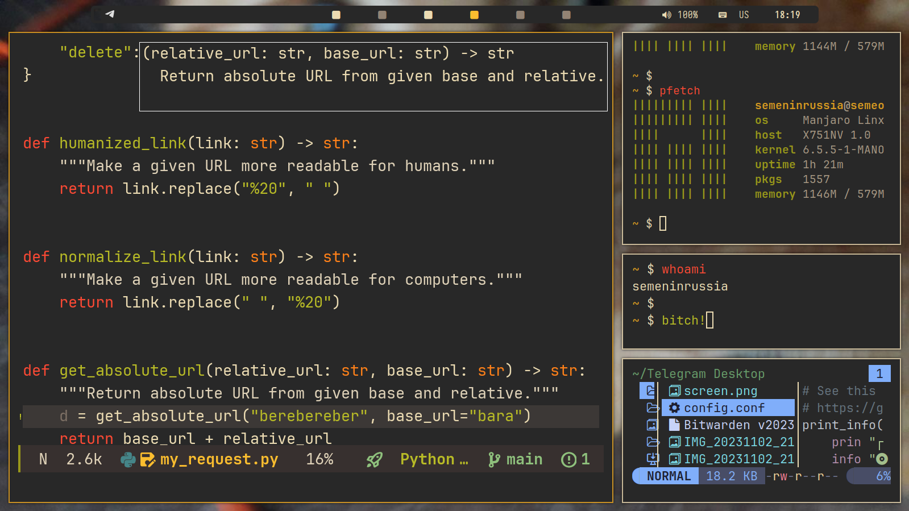
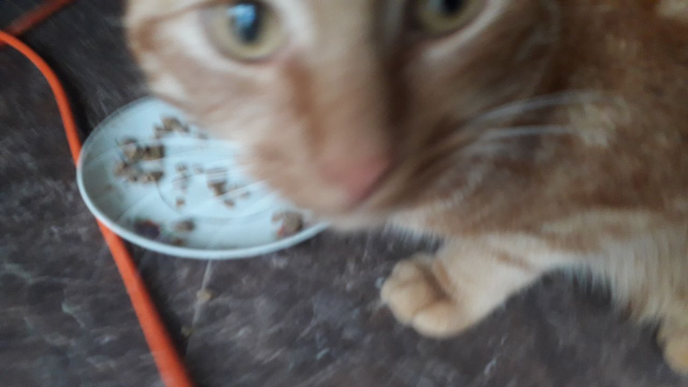

"Rafael" Rice
---

## Components

- bspwm
- Picom
- Alacritty
- Yazi
- Polybar
- Emacs (see my dots in other [repo](https://github.com/semenInRussia/emacs.el))

## Why "Rafael"?

Because the name of my cat is Rafael.

