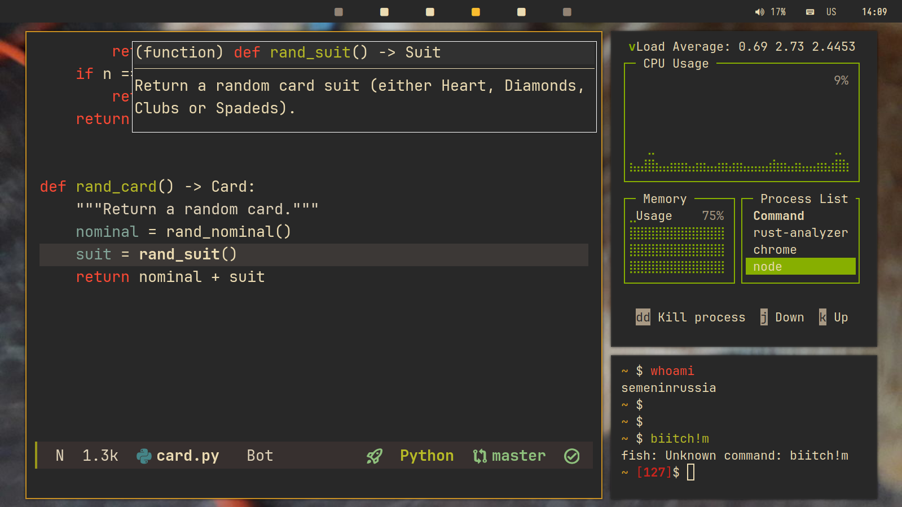

"Rafael" Rice
---

<!--  -->

## Components

- [bspwm](https://github.com/baskerville/bspwmm "a simple, but powerful WM")
- [Picom](https://github.com/yshui/picom "famous compositor")
- [Rofi](https://github.com/davatorium/rofi "DRun, but suckless")
- [Alacritty](https://github.com/alacritty/alacritty "the tRust terminal") + [Fish](https://en.wikipedia.org/wiki/Fish "the "best" shell")
- [Yazi](https://github.com/sxyazi/yazi "ranger, but in Rust so faster")
- [Polybar](https://github.com/polybar/polybar/ "sexy status bar")
- [Emacs](https://youtu.be/V3QF1uAvbkU?si=CPC71OCYCBASQnbV "emacs, yemacs, emacs!") (see my dots in other [repo](https://github.com/semenInRussia/emacs.el))

## Why "Rafael"?

Because the name of my cat is Rafael.

